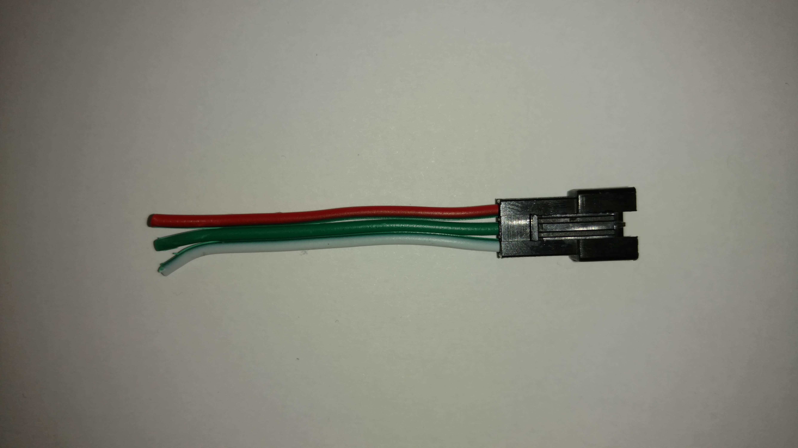
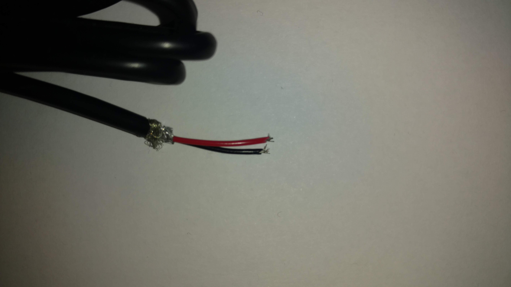
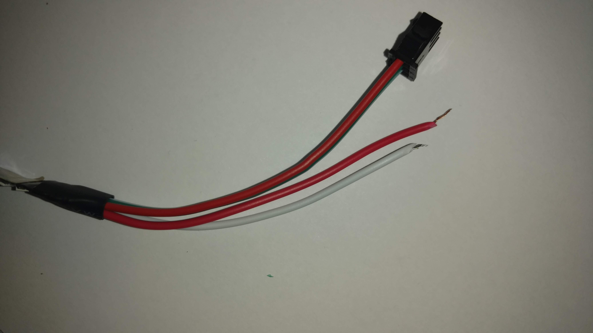
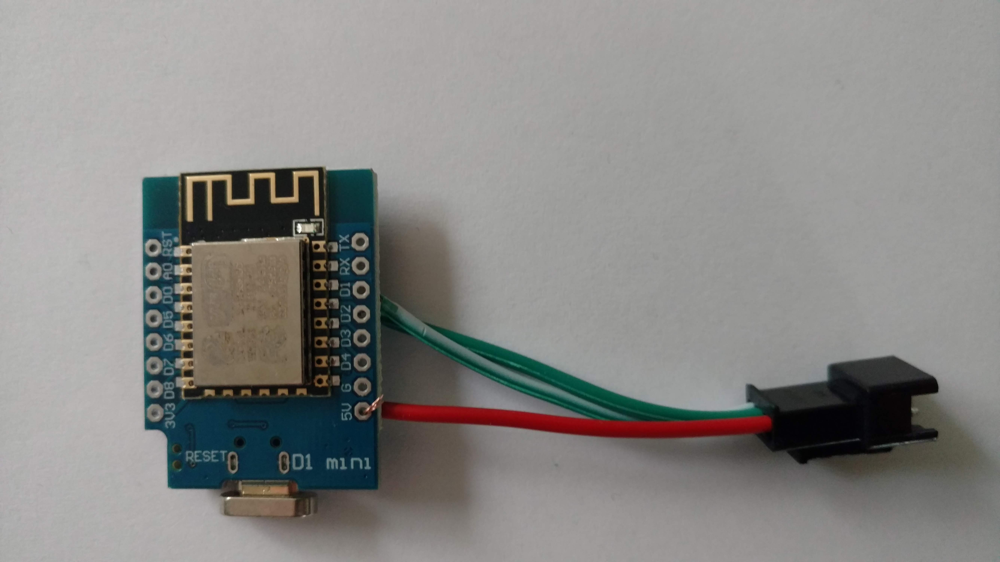
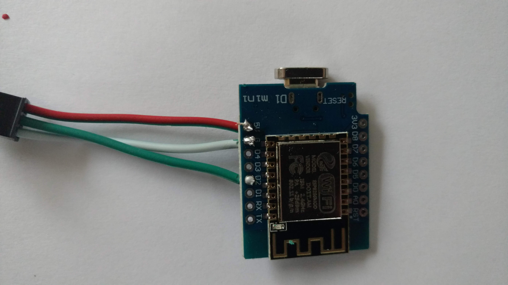
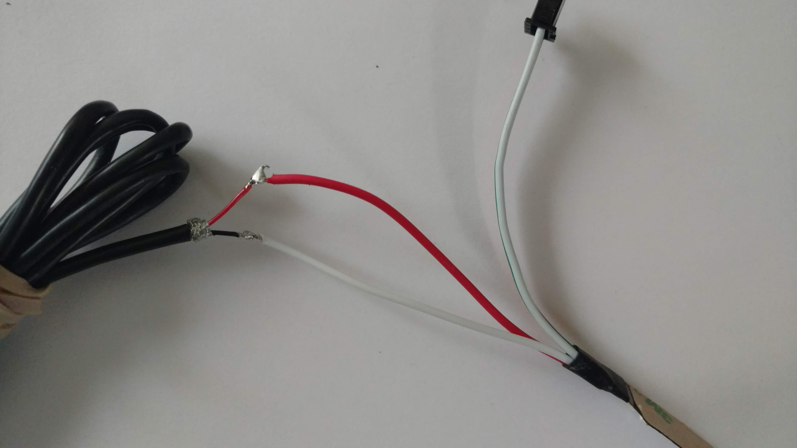
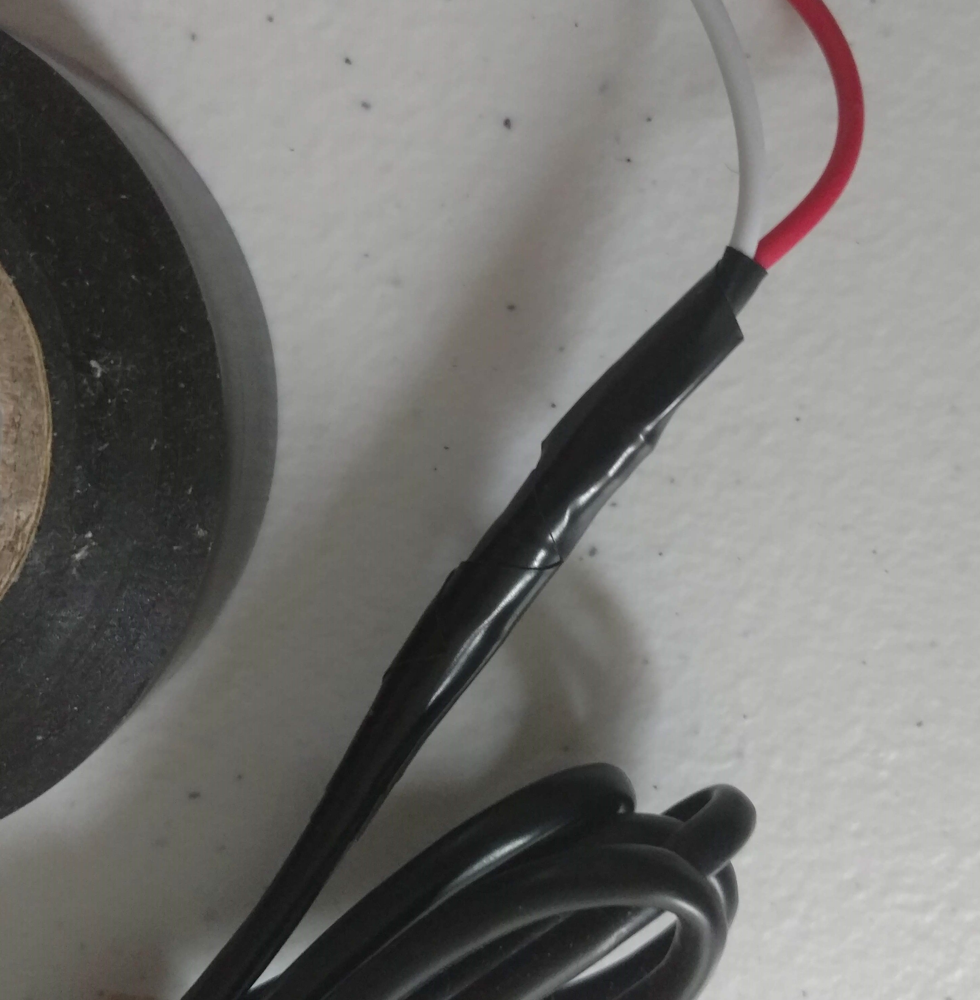

# AI-WHITEBOARD
Enhanced smart whiteboard adding AI intelligence

# IoT Whiteboard
ESP8266 based LED strip display of Yes/No API data.

Example API queries:
Will it rain today? Have I reached my Kickstarter goals? Snow day? Good windspeed to fly drone? 

Change settings easily by using captive WiFi portal.

Optimized circuit efficiency by using 60 pure red, green, or blue WS2812B LEDs.

Cheap - core parts cost < $10 US Dollars

# Tutorial:
## 1. Get Parts:
* Wemos D1 Mini - https://www.banggood.com/custlink/GvvK5E8B0P

* WS2812B Addressable LED Strip (You must cut down to 60 LEDs with scissors) - https://www.banggood.com/custlink/3GmmFR9ee8

* Soldering Iron & 60/40 Rosin Core Lead Solder: https://www.banggood.com/custlink/DmKDPhZ6e6

* 5V 2A+ Power Supply - **Must be at least 2 amps.** - I used a cut USB cable and a 2.1A USB Charger. https://www.banggood.com/custlink/mD3K5Y9egq 

* Hot Glue Gun with Sticks: https://www.banggood.com/custlink/KKvKHhSNEe

* Whiteboard or Acrylic Sheet and Dry Erase Marker: https://www.ebay.com/itm/16-24-35-47-Aluminum-Frame-Magnetic-Whiteboard-Dry-Erase-w-Board-Marker-Pen/311936582732?hash=item48a0de844c:m:m-E-ZRTFjVYbyOAs701hznw&frcectupt=true

## 2. Install the Drivers & Software
Unzip the files.

Install the CH340 drivers.

## 3. Install Arduino Script
Open up Arduino IDE, select your board type, and flash the .ino file to the board

## 4. Get a X.AI developer account and buy Grok API Tokens

## 5. Solder up your device
Strip wire tips

Then tin with solder then fuse together.

>D1 Mini ESP8266 5V---5V 2A Power---LED VCC

>D1 Mini ESP8266 GND---Ground 2A Power---LED Ground

>D1 Mini ESP8266 GPIO4(D2)---LED Strip Data In

**Green wire = data, Red wire = +5V, White wire = Ground**

Wrap individual connections in electrical tape or heat shrink tubing to insulate and prevent a short circuit.

**Most Addressable LED strips have two additional power wires for convenience**

## 6. Train the Device
The gadget broadcasts a WiFi captive portal you can connect to. type in 192.168.4.1 into a web browser after connecting, and paste in your WiFi network info, API key, and your desired prompts. 

## Further Resources

Due to memory constraints on the board, queries are not stored between reboots on the board, so each time you reconnect power to the gadget, you will need to reprogram the questions to display answers to.

